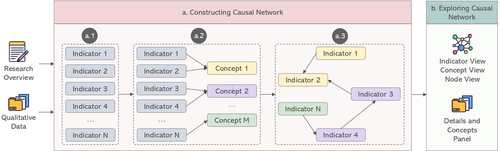

# [CHI 2026] QualCausal: Designing Computational Tools for Exploring Causal Relationships in Qualitative Data

[[Read the Paper]](https://doi.org/10.1145/3772318.3791953) [Han Meng](https://sites.google.com/view/han-meng/home), Qiuyuan Lyu, Peinuan Qin, Yitian Yang, Renwen Zhang, Wen-Chieh Lin, Yi-Chieh Lee

<div align="center">  </div>

## *What is QualCausal?*

This repository contains the source code and implementation for our CHI 2026 paper. We introduce a computational tool designed to assist researchers in exploring and identifying causal relationships within qualitative data. By integrating NLP pipelines and interactive visualizations, this tool aims to bridge the gap between qualitative analysis and causal inference.

## *License*

This project is licensed for **non-commercial use only**.

The source code, data, and models provided in this repository are intended for academic and educational purposes. Commercial use, including but not limited to using this software for profit-generating activities or integrating it into commercial products, is strictly prohibited without prior written permission from the authors.

### Repository Structure

The repository is organized into three main components:

```text
QualCausal/
├── frontend/   # Visualization interface
├── backend/    # Backend service and data management
├── ai/         # AI-based entity extraction pipeline
├── .gitignore
└── README.md
```
#### Frontend

The frontend/ directory contains the visualization interface used to explore qualitative causal structures.
	•	Implemented using modern web technologies
	•	Supports interactive inspection of entities, relations, and causal links
	•	Designed to reflect the visualization design presented in the paper

To run the frontend locally:
```code
cd frontend
npm install
npm run dev
```

#### Backend

The backend/ directory contains the backend service that supports data management and communication between the frontend and AI modules.
	•	Provides APIs used by the visualization interface
	•	Manages intermediate representations of extracted entities and relations
	•	Designed as a service module rather than a standalone application

Sensitive files (e.g., credentials, databases) have been removed from this artifact version

#### AI Module

The ai/ directory contains the AI-based entity extraction pipeline used in the QualCausal system.
	•	Implements automatic entity extraction and processing workflows
	•	Includes model inference logic and pipeline code
	•	Does not include training data or model checkpoints

Due to data privacy and size constraints, datasets and pretrained weights are not included in this repository.

#### Notes on Reproducibility

This repository provides an artifact-level implementation of the QualCausal system.
	•	The frontend module can be executed locally
	•	Backend and AI modules are provided for code inspection and architectural understanding
	•	Some components are provided in a simplified or reference-only form

This design follows common practices for sharing research artifacts while respecting data, security, and licensing constraints.

## *How do I cite this work?*

```bibtex
@inproceedings{meng2026designing,
  author    = {Meng, Han and Lyu, Qiuyuan and Qin, Peinuan and Yang, Yitian and Zhang, Renwen and Lin, Wen-Chieh and Lee, Yi-Chieh},
  title     = {Designing Computational Tools for Exploring Causal Relationships in Qualitative Data},
  booktitle = {Proceedings of the 2026 CHI Conference on Human Factors in Computing Systems (CHI '26)},
  year      = {2026},
  month     = {April},
  publisher = {ACM},
  address   = {Barcelona, Spain},
  doi       = {10.1145/3772318.3791953},
  pages     = {1--19},
  numpages  = {19}
}

```
